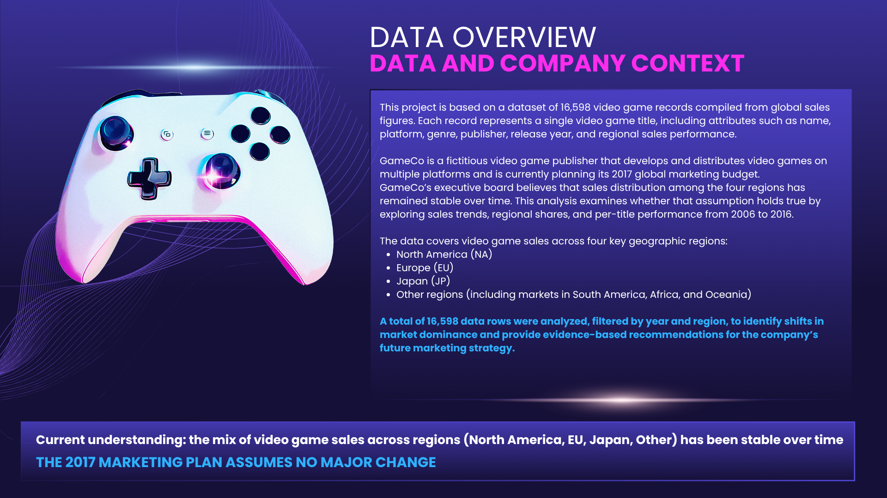
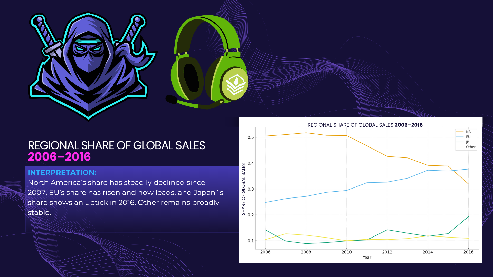
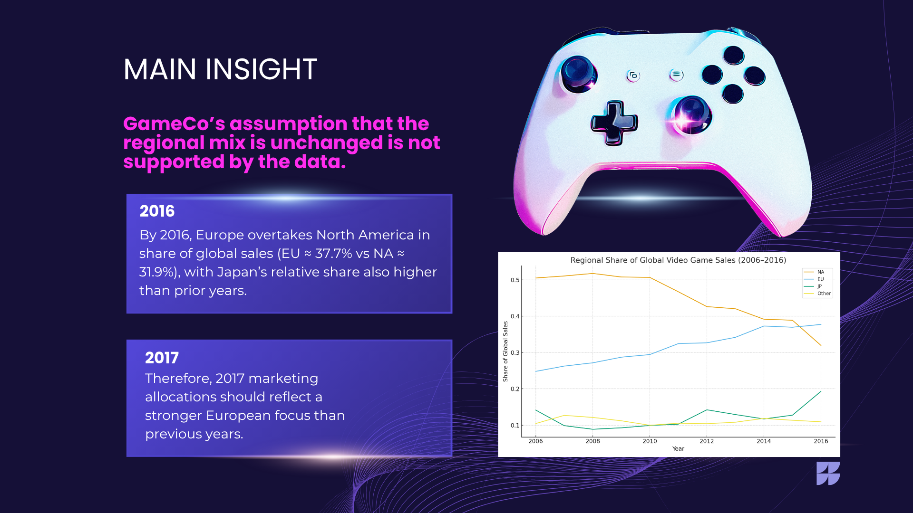
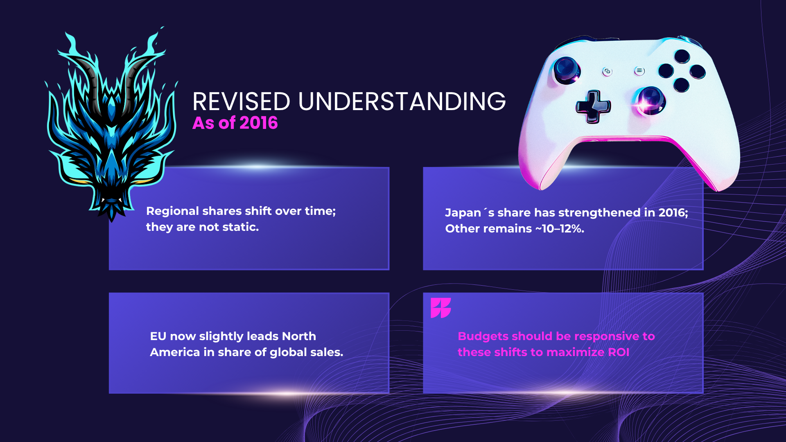
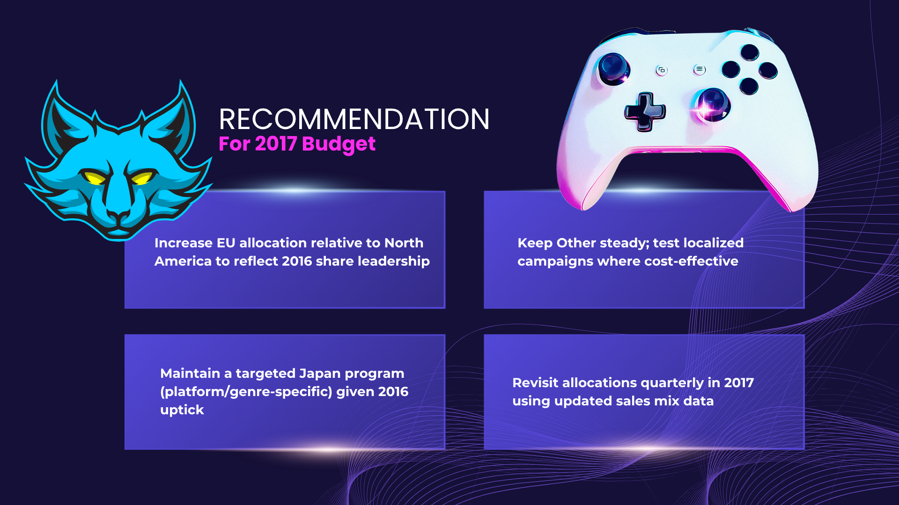
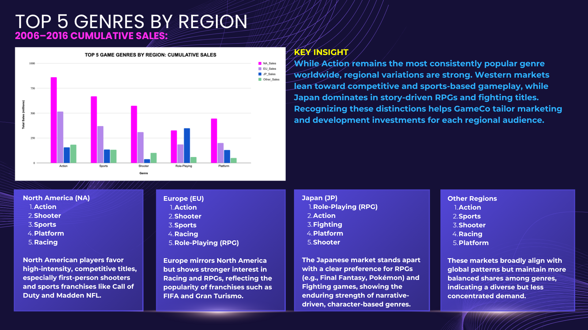
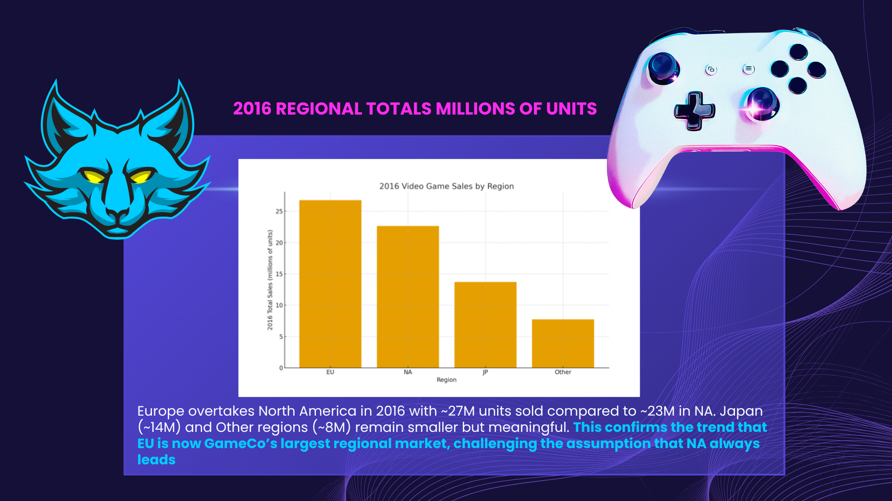
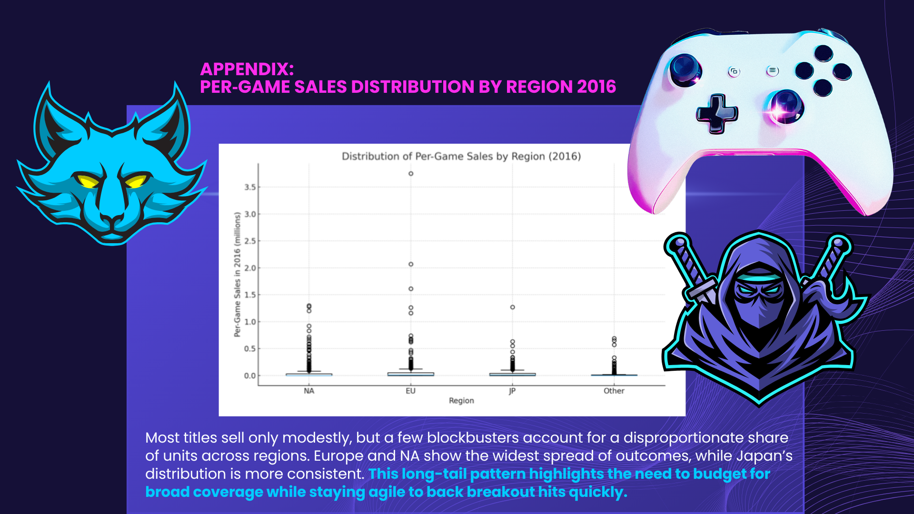

# GameCo Regional Sales Analysis

## Project Overview

This project analyzed historical regional video game sales data to evaluate GameCo’s assumption that the global distribution of video game sales remained stable over time.

The analysis focused on identifying changes in regional market share between North America (NA), Europe (EU), Japan (JP), and Other regions in order to support evidence-based marketing budget allocation for 2017.

A total of 16,598 sales records were analyzed to identify long-term regional trends, market shifts, and sales concentration patterns.

# Business Problem

GameCo was planning its 2017 marketing budget based on the assumption that regional sales patterns had remained stable over time.
The objective of this analysis was to determine whether regional demand had shifted between 2006 and 2016 and to identify how marketing investment should be adjusted to maximize ROI.

# Key Business Questions

# Has the regional distribution of video game sales remained stable over time?

The analysis found a significant shift in global sales distribution between 2006 and 2016.
Europe steadily increased its share of global sales while North America's share declined.
By 2016, Europe had overtaken North America as the largest regional market.

# Which region should receive the largest share of the 2017 marketing budget?

The data showed Europe accounting for approximately 37.7% of global sales compared with approximately 31.9% for North America in 2016.
Marketing investment should therefore be reallocated to reflect current market realities rather than historical assumptions.

# Are customer preferences consistent across all regions?

Significant regional differences exist.
North America favors Shooter and Sports games.
Europe shows strong demand for Racing and RPG titles.
Japan strongly favors RPG and Fighting genres.
Other regions display more balanced genre preferences.
These differences suggest that a global one-size-fits-all marketing strategy may not maximize returns.

# Should GameCo use a uniform global marketing strategy?

Regional differences in both market size and genre preference suggest that localized marketing campaigns are likely to outperform a uniform global strategy.
Targeted regional investments would better align with customer demand.

# How concentrated are video game sales?

Sales follow a long-tail distribution.
Most games generate modest sales, while a small number of blockbuster titles account for a disproportionate share of revenue.
This suggests GameCo should maintain a diversified portfolio while retaining flexibility to increase support for breakout successes.

# Business Recommendations

1. Increase European marketing investment to reflect its position as the largest regional market.

2. Maintain a targeted Japan strategy focused on RPG and Fighting game audiences.

3. Review regional sales performance quarterly rather than relying on historical assumptions.

4. Develop region-specific marketing campaigns aligned with local genre preferences.

5. Maintain a diversified release portfolio while allocating additional resources to emerging blockbuster titles.

# Why This Matters

This project demonstrates how data analysis can challenge executive assumptions and improve strategic decision-making. By identifying shifts in regional demand and customer preferences, organizations can allocate marketing resources more effectively and improve return on investment.

## Business Objective

GameCo planned its 2017 marketing strategy based on the assumption that regional sales proportions had remained relatively unchanged over time.

The objective of this analysis was to test that assumption and provide data-driven recommendations for future regional marketing allocation.

## Data Preparation & Analysis

Using the `vgsales` dataset, annual sales totals were aggregated by region and converted into percentage shares of global sales for each year between 2006 and 2016.

Additional analysis focused on:
- year-over-year regional share shifts
- regional market dominance trends
- 2016 regional sales comparisons
- per-game sales distributions
- concentration of high-performing titles

A dedicated 2016 subset was also created to generate summary statistics for regional sales performance, including:
- count
- total sales
- mean
- median
- standard deviation

---

## Key Insights

The analysis revealed several important market shifts:

- North America’s share of global sales declined steadily over time.
- Europe demonstrated a sustained increase in market share and slightly surpassed North America in total units sold in 2016.
- Japan showed moderate growth in 2016 but remained significantly smaller overall.
- Sales distributions across regions were highly skewed, with a small number of blockbuster titles generating a disproportionate share of total sales.

These findings challenged the assumption that regional sales distribution had remained stable over time.

---

## Visualizations & Storytelling

Key visualizations included:

- Line charts showing regional share trends from 2006–2016
- 2016 regional comparison bar charts
- Box plots illustrating per-game sales distributions

The final presentation refined these visuals to emphasize:
- long-term regional market shifts
- changing sales dominance patterns
- implications for strategic marketing allocation

---

## Tools & Concepts

- Data Analytics
- Excel
- Data Cleaning
- Descriptive Statistics
- Data Visualization
- Trend Analysis
- Business Intelligence
- Executive Storytelling

---

## Business Recommendation

The analysis suggested that GameCo should reconsider a static regional marketing allocation model and increase strategic attention toward the growing European market while continuing to monitor emerging regional trends.

****
---

## Author

Sonja Morris  
Business Intelligence | Data Analytics | Learning Analytics
